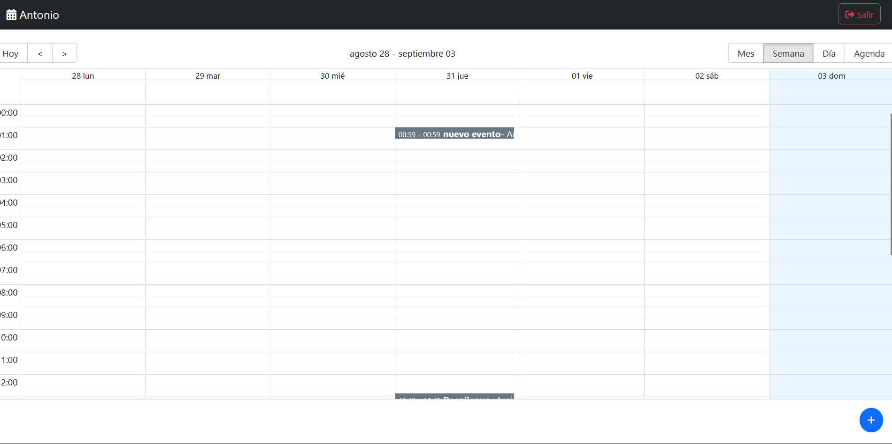
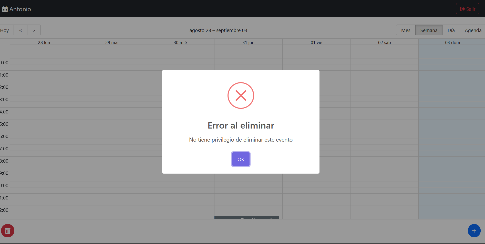
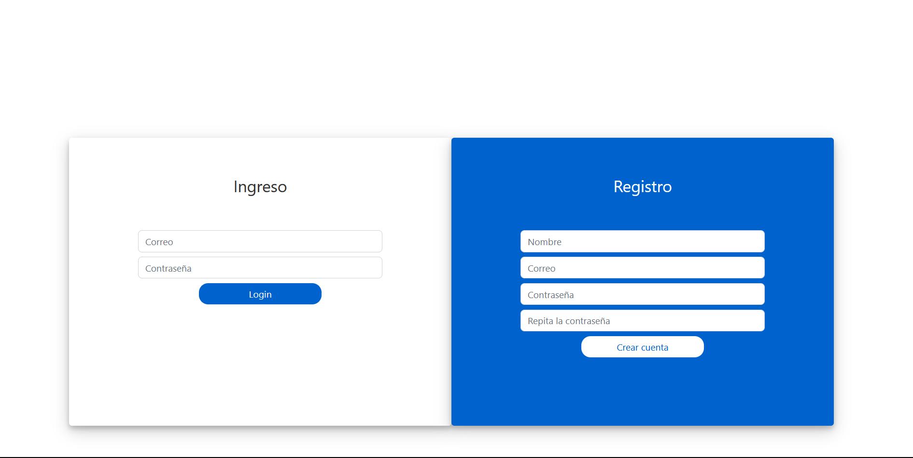
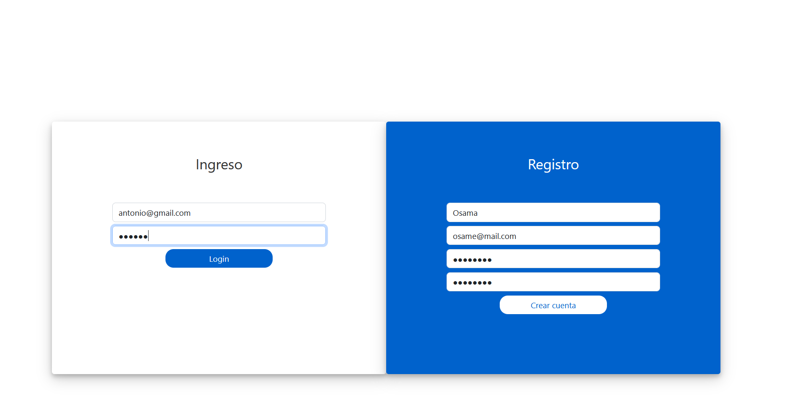

# Calendar React Redux Toolkit

Este proyecto es una aplicación de calendario desarrollada con React y Redux Toolkit. Proporciona una interfaz de usuario para gestionar eventos en un calendario.

## Instalación

Asegúrate de tener Node.js y npm instalados en tu sistema. Luego, sigue estos pasos:

1. **Clonar el repositorio:**

```
git clone https://github.com/elto82/calendar-react-reduxt.git
Ir al directorio del proyecto:

cd calendar-react-reduxt
Instalar las dependencias:

npm install
Iniciar la aplicación en modo de desarrollo:

npm run dev
La aplicación se ejecutará en http://localhost:3000 en tu navegador.
```

## Funcionalidades Principales

Gestión de eventos en un calendario interactivo.



Creación, edición y eliminación de eventos.


Visualización de detalles de eventos.



Autenticación de usuarios.





## Tecnologías Utilizadas

React: Biblioteca de JavaScript para construir interfaces de usuario.

Redux Toolkit: Herramienta para gestionar el estado de la aplicación de manera eficiente.

React Router: Enrutador para manejar la navegación dentro de la aplicación.

Axios: Cliente HTTP para realizar peticiones a un servidor.

Jest: Framework de pruebas unitarias.

ESLint: Herramienta de linting para mantener un código limpio y consistente.

Vite: Herramienta de desarrollo rápida para proyectos de JavaScript y React.

## Contribución

Si deseas contribuir a este proyecto, ¡estamos abiertos a colaboraciones! Siéntete libre de crear un pull request o reportar problemas.

## Licencia

Este proyecto está bajo la Licencia MIT. Consulta el archivo LICENSE para obtener más detalles.
